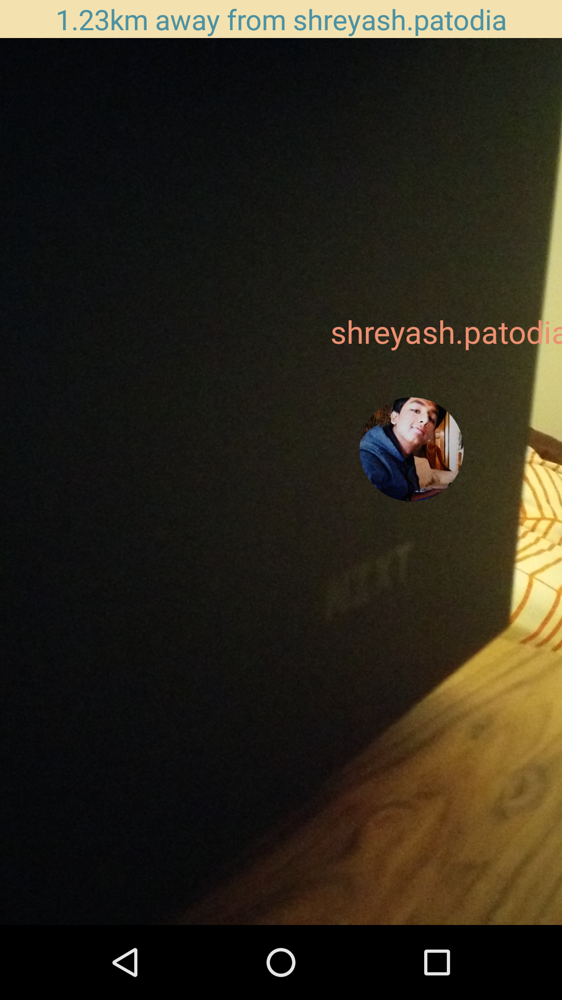

##### Build Status
> Quick tip: [Build Status](https://hellium.me:8443/job/Helium-Beta/)

Table of contents
===
* [Peachy Strawberry](#peachy-strawberry)
    * [Latest Build Status](https://hellium.me:8443/job/Helium-Beta/)
    * [Build Status Information](#build-status)
* [Background](#background)
* [Android Support](#android-support)
* [Setup Instructions](#setup-instructions)
    * [Building and Exporting](#building-and-exporting)
    * [Testing](#testing)
* [Usage](#usage)
* [Features](#features)
    * [Facebook Login](#facebook-login)
    * [Friend Location Map](#friend-location-map)
    * [Chatting](#chatting)
    * [Augmented Reality](#augmented-reality)
* [Future Features](#future-features)
    * [Account Creation](#account-creation)
    * [Username Login](#username-login)
    * [Reset password](#reset-password)
    * [Connecting account to Facebook](#connecting-account-to-facebook)
    * [Disappear from map](#dissapear-from-map)
    * [Adding Friends via username](#adding-friends-via-username)
    * [Group Chat](#group-chat)
    * [Machine Learning - Automated meet-up location](#machine-learning---automated-meet-up-location)
    * [Avatar selection](#avatar-selection)
* [Testing](#testing)
* [Appendix](#appendix)


# Peachy Strawberry
This is a **client-side _Android_** application maintained by Team Helium.

Team Helium is:
* __Tutor__ Luca Morandini
* 719577 Max Lee (Ho Suk Lee)
* 743413 Jia Hong Fong
* 715944 Yifei Wang
*  Jessie Guo
* 767336 Shereayshjasd

Our android application is aptly named **Peachy Strawberry**.

###### Build Status
Check out our (most probably passing) build status [here](https://hellium.me:8443/job/Helium-Beta/)!

We ran [Jenkins](https://jenkins.io/) as our personal  CI/CD ~~butler~~. It is hosted on a free
VM provided to University of Melbourne students in 
[Nectar Cloud](https://nectar.org.au/research-cloud/). For reasons beyond my comprehension, Firefox
seems to think our SSL cert is unsafe. If that's the case for you, try using Chrome instead. I
assure you nothing dodgy is going on.

There, a build badge shows the current build status and a dedicated HTML report will show
all passed/failed tests should you click on it.


<!-- ===============================  section one   ====================================== -->
# Background
This repository is in charge of the mobile application, 
ranging from services like chat, augmented reality, and location services.
##### Motivation
Google Maps is a great way to find where to go, but when meeting friends it only tells us if 
we are in the right place and not how far from our friends we actually are. We could be 
going to a concert and be at the venue, but it’ll be extremely hard to find 
your friend at the venue. With this application we hope to be able to not only help users 
get to the venue but also to find friends at the venue.


<!-- ===============================  section two ====================================== -->
# Android Support
TODO: what version we support, what caveats and what quirks to be aware of.


<!-- ===============================  section three ====================================== -->
# Setup Instructions
This is your run of the mill android studio project. Simply clone this repository and open it as
an android project from within [Android Studio](https://developer.android.com/studio/index.html).
#### Building and Exporting
To build this project, simply click the build button in Android Studio and the application will be
built into any connected Android device(or emulator).
#### Testing
The testing suite is separated into _unit_ and _instrumented_ testing.

To run either one, simply choose from the dropdown menu between the hammer and play icon on
Android Studio's top menu bar, and select the appropriate test suite.

Alternatively, unit tests can be run from the command-line using the 
```
$ ./gradlew test
```
 command at Helium-Beta's root directory.
 
 
<!-- ===============================  section four ====================================== -->
# Application Outline and Usage
Before stepping in-depth into the [features](#features) we have, this section explores the overview
of how a user can/should use **Peachy Strawberry**. **Maybe we should add a fake facebook account to
allow Luca to download and login to the app**

1. Upon entering the app, first time users (or logged out users) will be prompted to login into their
facebook accounts. First time users will also be prompted to accept location and camera permissions.
We chose to use a facebook login because people would generally tend to download our application as
a means to find friends and not as a social media, so by giving them the ability to simply download
the application and login via facebook (thus, adding all your facebook friends that use the application),
in order to not lose potential users over the hassle of adding and maintaining a friend's list. 
2. You're greeted by a (a-better-looking-google-map-lookalike) map that displays all your friends. In
order to make our application unique we chose to use the map as the basic user interface and made
several modifications to the map (more on this later). All of your friends will appear on the map with
the same avatar as their facebook profile picture.
   * If you're trying to find a friend that's too far away, you can use the search bar to find him/her
    using his/her facebook profile name. You will hone in their direction immediately upon selection. 
3. By tapping on a user's profile picture or searching (see above), the camera shifts focus onto
that user and displays a route to him/her with a particular mode of transport. You're free to change
the default mode. The ETA and distance will be calculated shortly.
4. By tapping a user, you also bring up a [small bubble](#small-bubble) that shows 2 buttons. The leftmost 
being the chat button. The rightmost button re-directs you to our AR with this user as its target.
5. If you tap the chat button, you get to chat with the selected user. Surprise surprise!
   * To exit chat mode swipe the button with the arrow (next to the edit box for your messages) to the
   right.
6. Assuming you're close enough to the user that you're itching to use our fabulous AR, tap on the user
again to bring out the bubble, then tap on the directional (rightmost) icon.
7. In the AR mode, you'll see (at most) 5 avatars on-screen. The biggest avatar is the currently tracked
friend. The top HUD shows how far away you are to that person. The smaller avatars are friends in that
general direction, but since they're not your target of interest, they appear smaller. If the selected
user is not in the line of sight of the camera then a directional arrow along with their profile picture
will appear on the side of the screen you need to turn to in order to have them in the line of sight (the
arrows positioning is relative to not just left or right but also relative to the user's GPS height
with respect to your height), this does not happen for other users because they are not the point of
interest for us.
    * A useful feature is to tap the user's profile in AR mode again to enter FOCUS mode. In this mode,
    all other (smaller avatar) friends will disappear, leaving the actively tracked user in AR only.
    You should receive a vibration when this happens to notify you that you're in FOCUS mode.
    * Tap the FOCUSED user again to bring your (smaller avatar) friends back out.
    * If your device's sensors are poor, it will also display a message prompting you to calibrate it.
    AR will also show you the distance to the selected user, or it will say that you have arrived at the
    same location when you are close enough but this obviously depends on how accurate the GPS readings
    on the phone are.
8. Tap the back button on your android device to exit AR mode anytime.

 
 


<!-- ===============================  section five ====================================== -->
# Features
Here, we go in (a little more) detail of how each feature works, with some diagrams.

#### Facebook Login and Auto-Import Friends from Facebook
We chose to use facebook login, since anyone who is tech-savvy enough to use our application
will have a facebook account, and they will download the application when they need to "find
a friend", and would not want to go through the hassle of having to download the application,
sign-up and then add new friends in order to find them. By using facebook new users are just
a couple of clicks away from being able to use our application. We also, auto-add all the
facebook friends that are using the application as it again aids easy start-up when using
our application. Using facebook also alleivates any concerns users might have about our
application since we are a new start-up, as they know that facebook won't give up any 
information about them to us and their data is safe.

#### Friend Location Map
Our map is the base user interface for the application, it provides a bird's eye view of the
user's location and their friends' location. We use google maps in order to implement our
friend's map but we modify it quite a bit in order to achieve the application we wanted.
First of all, in order to make it explicit that our application is meant to help you locate 
people in some way and we think this experiment was successful according to the usability 
testing we did for our application. Our map's colour-scheme is not the only thing that we
modified from a normal google map, we also show the user's facebook profile picture instead
of showing a normal marker. When we click on the default google map, an info-window shows
up (insert picture here) and the info-window cannot be used as a menu, it is clickable
as a whole but buttons on the info-windows will not be individually clickable, but to 
achieve what we thought was the best expeirence possible we created our own info-window,
interecpted touch events on the info-window, calculated where the touch was happening and
activate either the chat or the ar buttons accordingly. If you want to find your friend, then
you can choose any of the array of transport options we provide, as soon as you choose a
transport option, a path to the user will accordingly show up and an estiamted distance
and time of arrival will be displayed as well. If you are unaware of what country a friend
might be in, it is not efficient to zoom out of the map and look for the friend, so what we
have is a search feature that not only suggests friends to located as soon as you start 
typing it also hones to the friends location upon selection of the friend. This allows for
smooth transition between friend tracking and would alleviate one of the potential drawbacks
of having the map as the main ui. Here is a look at our map and our search feature:


#### Chatting	
In order to make our application seem very simplistic and easy to use we tried to integrate
chat into the main functionality of being able to find friends, we also wanted to provide
people an intuitve way to switch between the two. As mentioned earlier the [small bubble](#small-bubble)
has a chat button on the left. This open a chat window which overlays our map, we have made
the chat boxes dark enough to be able to allow for easy reading but we also kept it translucent
so that the user knows it is easy to get out of chat with one swipe of the button on the left of
the chat edit box. Our chat functionality also comes with notifications, wherein a user
will get notifications when they receive a message from a friend. We also have **automatic
notifcations** when someone starts tracking you, a message from that friend will be generated
and sent to you saying that they are headed to your location. 

#### Augmented Reality
Augmented reality help users navigate their way to their friend when they're close enough.
After selecting a friend on the home page (map view), click the directional icon on the 
[small bubble](#small-bubble).
This transitions the page into a camera view. The user is immediately greeted with their friend's
avatar (augmented) on screen with their name around it, in case you forgot your friend's name.


As seen in the image, if (up to) 4 other friends are in the same direction as your target, they appear
as smaller avatars in the background. However, they are not your active target, hence, if your
target is _off-screen_, the **arrow guide** will only show the currently active target.


As mentioned earlier, users can enter _focus_ mode by tapping the desired user. You will receive a
vibration to confirm this. In this mode, only the actively selected user is displayed in AR.



To exit _focus_ mode, simply tap the avatar again, and all your other friends will re-appear.

This also implies that you can switch your actively selected target 
**on the fly** in AR mode just by tapping their avatar, there's no need to exit AR and select from the map.

Finally, you also get to know the distance between you and your actively selected friend on the
display above. When you're close enough, it'll change to: _You've arrived at `<name here>`'s destination_.
It also displays other useful information - if your sensor readings are poor, it'll prompt you to
calibrate your phone with on-screen instructions.


<!-- ===============================  section six ====================================== -->
# Future features
This section briefly describes our goals for the future as we move on to publish the app to the app store:

#### Account Creation
Allows users to create an account with **Peachy Strawberry**.

#### Username Login
Going along with Account Creation, this allows users to login to their **Peachy Strawberry** account
instead of their Facebook account. 

#### Reset password
Going along with Account creation, this allows users to reset their password.

#### Connecting account to Facebook
Going along with Account Creation, it is also possible for users to link their Facebook account
with their **Peachy Strawberry** account.

#### Disappear from map
Prevents unwanted stalkers(friends) from seeing user's location.

#### Adding Friends via username
Instead of automatically porting all Facebook friends, this option let users choose their
friends in the app. That way, users have more privacy.

#### Group Chat
Ability to create a channel with more than 2 users in a chat room.

#### Machine Learning - Automated meet-up location
Suggests a location to a ground channel. This uses public user information from
Facebook and learning user behaviour by remembering their past locations. Then, with appropriate
machine learning techniques, the application can suggest places that the group would most
likely/conveniently meet.

#### Avatar Selection
Instead of displaying user profile pictures from Facebook, this allows users to upload their own
profile picture.


### Appendix

#### Small bubble
The 'small bubble' when tapping a user in **Peachy Strawberry**'s map view.


